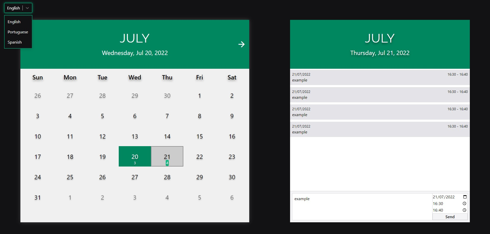

# Calendar-React

It is a calendar made for schedule todos

> ## Features

- Create, list, filter and delete todos
- Save on LocalStorage
- Supported languages: English, Portuguese, Spanish

> ## Technologies

- React (ContextApi, Memo)
- Typescript
- LocalStorage
- Date Object
- TailwindCSS
- PostCSS
- Vite
